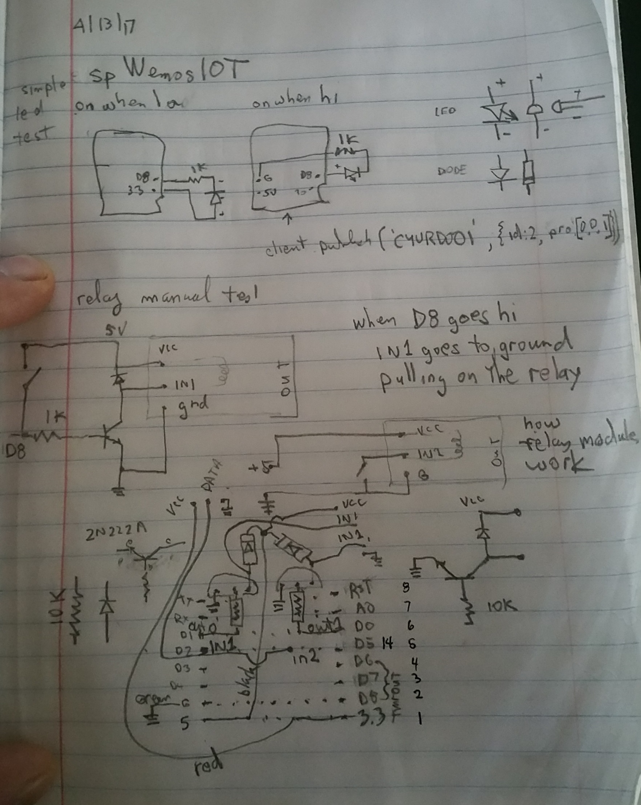
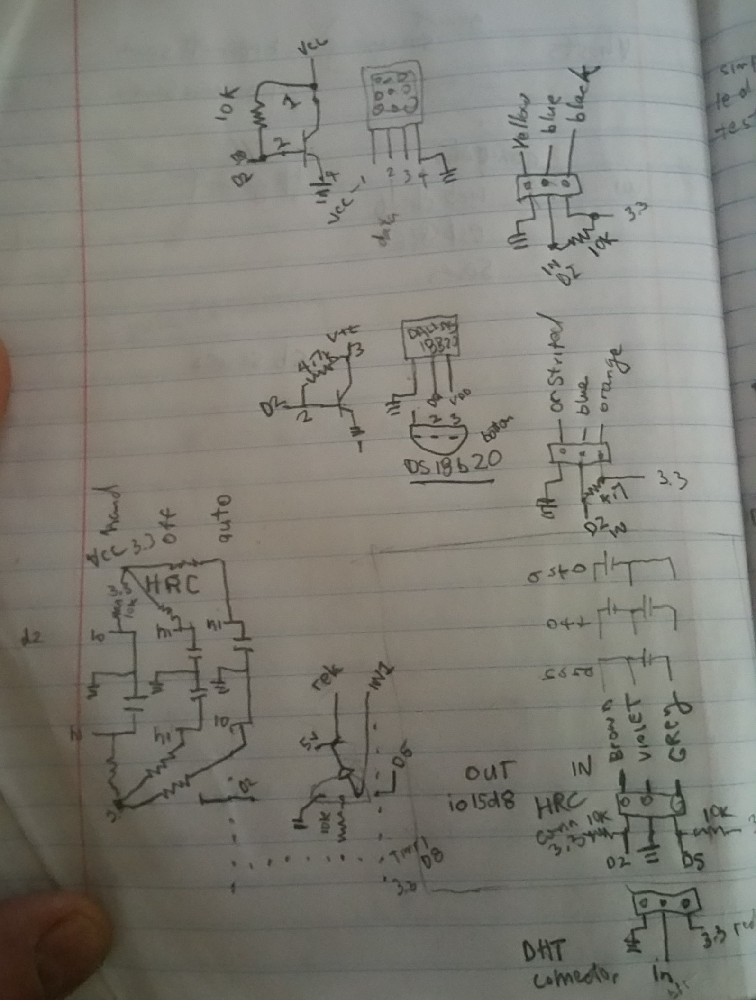

# IOT platform apps
https://github.com/knolleary/pubsubclient

## tags
## 11-dailyAlarm-getTime
In another defeat of catch 22:), on setup() set a `Alarm.timerOnce(10,  dailyAlarm` which sets up a daily alarm that runs `(10*((int)devid[6]-'0')+(int)devid[7]-'0')%16` minutes after midnight to send a devid/time request to IOTbroker.
## 10-auth-remote-change-cfg-over-mqtt
processIncoming set
## 09-auth-MQclient_reconn-cfgsimple
Now device authenticates using real config.cpp owner and pwd. Config from data/config.json gets sent to device from ArduinoIDE Tools/ESP8266_Sketch_data_upload (with terminal closed) any time you want. 

wifiManager just needs ssid and ssidpwd all other config comes from data/config.json.
## 08-auth
add userName and password Authentication shell to both spWemosIOT/auth/main/Mqclient.cpp and to oahoRaw.html as long as userName="tom@sitebuilt.net" and password='freddy'. 

So from clentId, uesrName and password we need to know whatrs up
Username should be device.owner for device and user for client.

Details...

## todo

## setup
* CYURD001 ds1820b: original test board 2 ds1820b on input(io4d2), relay on temp1(io5d1)
* CYURDOO3 dht:humidity temp control for noah's shrooms -dht11+2relays 1 input, 2output
* CYURDOO6 ds1820b temp: outdoor thermometer -ds1820b, 1 input
* CYURDOO5 either hrc: heated roof control-1 relay, 2inputs, 1output
* CYURD004 dht  timerrelay: timer for plants 1relay 1 output DHT11 input io14d5
* irrig12v: water valve 1timer output (moisture level input)

* ^ bundle components into 4 sets
* ^ solder connectors on wemos
* ^ test led - make test component
* ^ test relay - create relay component if needed
* test dht11 temp humidity sensor
* copy separate project files

### Understanding the code 
#### test relay
software: the device understands a command like 
`client.publish('CYURD001/prg', {"id":2,"pro":[[0,0,1]]})` 
to do that and `blank/aclient/rawSb.html`'s 'turnOnOff()' accomplishes that for timer 1 which outputs on/off on `io15d8` pin on the wemos

hardware: First just manually operate the relay by connecting it to a power supply. Relays work when input us given a path to ground. They need to be driven by a transistor and protected by a diode. Mock up that circuit to check it. 
#### dht test
* http://randomnerdtutorials.com/esp8266-dht11dht22-temperature-and-humidity-web-server-with-arduino-ide/ download from here
* duplicate blank as dht
* `sketch/include libraries/manage libraries` and search for dht. Install. and install adafruit unified sensor
* read DHT from `io14d5` send it out with temp->temp1 and humidity->temp2

## tags
### 07-paho-lightsoff-hrs

switch to Paho's `mqttws31.js`

changed `etc/nginx/sites-available/services` to
`
      location /geniot/ws:3333 {
         proxy_pass http://localhost:3333;

        function connect() {
            client.connect({onSuccess:onConnect, useSSL:true});
        }
    client = new Paho.MQTT.Client("services.sitebuilt.net/geniot/ws", 3333, "pahoSB"+Math.random()*1000000);

`
### 06-sensor_type-hrc
### 05-wifimanager
### 02-relay_dht_tests
Relay is only set when a `readTemp` happens and the temp has changed. Relays also need to be set when a new program resets the hilo limits which happens in `sched:ckAlarms`
### 03-adjHeat-onPrgChange
wipes out days program, puts in a hold. If you want to boost for an hour starting in 30 minutes, then the client would have to grab the days program and insert the boost into it. 
### 04-adjHeat-onStateChange
just changes state or hilo for the duration of the current program. Reverts to program control at next program event for that sensor/relay.

